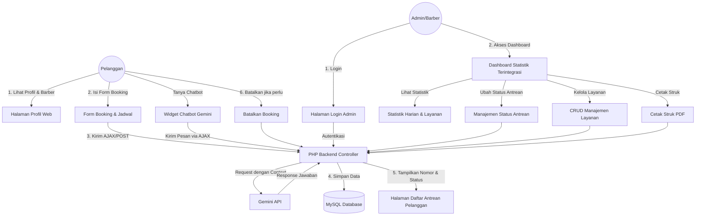
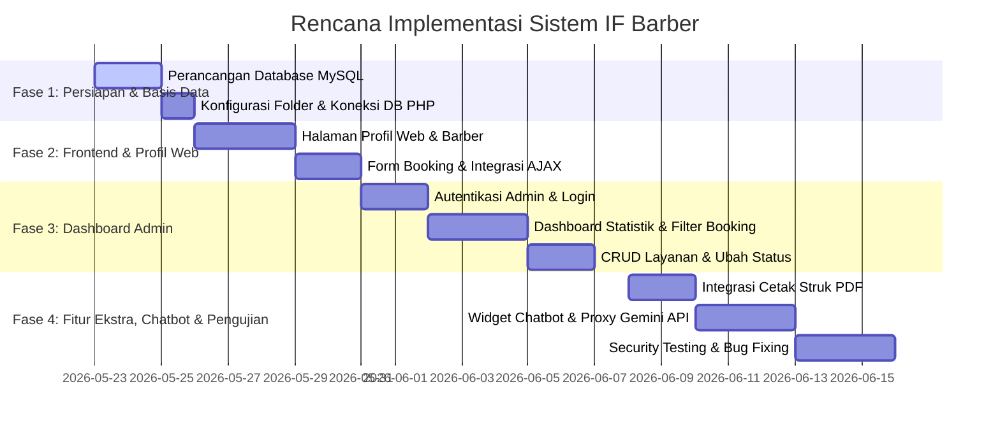

# Product Requirement Document (PRD)
## Sistem Antrean & Booking Layanan Barbershop (IF Barber)

Dokumen ini menjelaskan persyaratan produk, spesifikasi teknis, arsitektur data, dan alur kerja untuk **IF Barber**, sebuah sistem manajemen antrean dan pemesanan (booking) layanan barbershop berbasis web yang responsive dengan backend PHP.

---

## 1. Ringkasan Eksekutif & Tujuan Proyek

### 1.1 Latar Belakang
Industri barbershop berkembang pesat, namun manajemen antrean fisik sering kali menyebabkan waktu tunggu yang lama bagi pelanggan dan ketidakefisienan operasional bagi barbershop. Banyak barbershop masih mengandalkan pencatatan manual atau sistem antrean "first-come, first-served" yang tidak terukur.

### 1.2 Solusi & Tujuan
**IF Barber** hadir sebagai platform web modern yang menjembatani pelanggan dan pengelola barbershop. Pelanggan dapat melihat profil barbershop, memilih barber favorit berdasarkan spesialisasi mereka, memilih layanan, dan melakukan booking jadwal secara online. Admin/Pemilik barbershop memiliki dashboard statistik terintegrasi untuk melacak performa bisnis harian, mengelola status antrean secara real-time, mengelola layanan (CRUD), dan mencetak struk transaksi/antrean.

---

## 2. Arsitektur Sistem & Spesifikasi Teknologi

Sistem dirancang untuk ringan, cepat, dan aman menggunakan arsitektur berbasis PHP.

### 2.1 Tech Stack yang Direkomendasikan
*   **Frontend**: HTML5, Vanilla CSS3 (desain kustom modern dengan estetika premium gelap/warm-gold wood), Vanilla JavaScript (ES6) untuk manipulasi DOM interaktif dan AJAX.
*   **Backend**: PHP (PHP 8.x) dengan arsitektur bersih (bersih dari kerentanan dan modular).
*   **Database**: MySQL / MariaDB.
*   **PDF Generation**: Library PHP ringan seperti FPDF atau TCPDF untuk mencetak struk.

### 2.2 Diagram Alur Sistem (Mermaid Workflow)



---

## 3. Desain Database (Schema Relasional)

Untuk mendukung semua fitur di atas, berikut adalah rancangan schema database MySQL yang ternormalisasi:

### 3.1 Tabel `admins`
Menyimpan data kredensial admin untuk autentikasi masuk ke dashboard.

| Nama Kolom | Tipe Data | Atribut | Deskripsi |
| :--- | :--- | :--- | :--- |
| `id` | INT | PRIMARY KEY, AUTO_INCREMENT | ID unik Admin |
| `username` | VARCHAR(50) | UNIQUE, NOT NULL | Username untuk login |
| `password` | VARCHAR(255) | NOT NULL | Hash password (menggunakan `password_hash()` bcrypt) |
| `name` | VARCHAR(100) | NOT NULL | Nama lengkap admin |
| `created_at` | TIMESTAMP | DEFAULT CURRENT_TIMESTAMP | Waktu pendaftaran akun |

### 3.2 Tabel `services`
Menyimpan katalog layanan cukur/perawatan yang ditawarkan beserta harganya (CRUD penuh).

| Nama Kolom | Tipe Data | Atribut | Deskripsi |
| :--- | :--- | :--- | :--- |
| `id` | INT | PRIMARY KEY, AUTO_INCREMENT | ID unik Layanan |
| `name` | VARCHAR(100) | NOT NULL | Nama layanan (misal: "Classic Haircut", "Hair Dye") |
| `duration` | INT | NOT NULL | Estimasi durasi dalam menit (misal: 30, 45) |
| `price` | DECIMAL(10,2) | NOT NULL | Harga layanan |
| `description` | TEXT | NULL | Penjelasan singkat mengenai layanan |
| `created_at` | TIMESTAMP | DEFAULT CURRENT_TIMESTAMP | Waktu input layanan |

### 3.3 Tabel `barbers`
Menyimpan profil para pemotong rambut (barber) termasuk spesialisasi mereka.

| Nama Kolom | Tipe Data | Atribut | Deskripsi |
| :--- | :--- | :--- | :--- |
| `id` | INT | PRIMARY KEY, AUTO_INCREMENT | ID unik Barber |
| `name` | VARCHAR(100) | NOT NULL | Nama lengkap barber |
| `photo` | VARCHAR(255) | NOT NULL | Path/nama file foto barber yang diunggah |
| `bio` | TEXT | NOT NULL | Deskripsi/biografi singkat barber |
| `skills` | VARCHAR(255) | NOT NULL | Keahlian utama (dapat berupa comma-separated tags, misal: "Fade, Pompadour, Beard") |
| `created_at` | TIMESTAMP | DEFAULT CURRENT_TIMESTAMP | Waktu input barber |

### 3.4 Tabel `bookings`
Menyimpan data transaksi booking jadwal antrean.

| Nama Kolom | Tipe Data | Atribut | Deskripsi |
| :--- | :--- | :--- | :--- |
| `id` | INT | PRIMARY KEY, AUTO_INCREMENT | ID unik booking |
| `booking_code` | VARCHAR(10) | UNIQUE, NOT NULL | Kode booking unik (misal: BFK-20260522-01) |
| `customer_name` | VARCHAR(100) | NOT NULL | Nama pelanggan |
| `customer_phone` | VARCHAR(15) | NOT NULL | Nomor telepon pelanggan untuk konfirmasi |
| `service_id` | INT | FOREIGN KEY, NOT NULL | Relasi ke tabel `services` |
| `barber_id` | INT | FOREIGN KEY, NOT NULL | Relasi ke tabel `barbers` |
| `booking_date` | DATE | NOT NULL | Tanggal pelaksanaan booking |
| `booking_time` | TIME | NOT NULL | Jam pelaksanaan booking |
| `queue_number` | INT | NOT NULL | Nomor antrean pada tanggal tersebut |
| `status` | ENUM | NOT NULL, DEFAULT 'waiting' | Status: `'waiting'` (antre), `'in_progress'` (sedang dicukur), `'completed'` (selesai), `'cancelled'` (dibatalkan) |
| `created_at` | TIMESTAMP | DEFAULT CURRENT_TIMESTAMP | Waktu pendaftaran antrean |

---

## 4. Persyaratan Fungsional (Functional Requirements)

### 4.1 Modul 1: Halaman Profil Web & Landing Page (Frontend Responsive)
Halaman ini adalah wajah barbershop yang dapat diakses oleh publik untuk memikat pelanggan baru dan memberikan kemudahan booking.

*   **FR-1.1: Landing Profile Barbershop**
    *   Sistem menyajikan sejarah singkat, filosofi, visi misi, serta jam operasional barbershop.
    *   Menampilkan daftar keunggulan barbershop (misal: ruang ber-AC, free soft drink, barber bersertifikat, pomade premium).
*   **FR-1.2: Portofolio Barber (Meet Our Barbers)**
    *   Menampilkan daftar barber aktif berupa kartu profil (cards).
    *   Setiap kartu menampilkan foto asli barber, nama, bio singkat, serta badge spesialisasi (skillset seperti *Skin Fade, Crop Cut, Beard Shaving*).
*   **FR-1.3: Responsive Web Design**
    *   Antarmuka pengguna wajib responsif, ramah seluler (mobile-first approach), menggunakan transisi CSS yang halus, efek *glassmorphism* modern, dan tema warna premium (seperti *Midnight Black* dipadukan dengan aksen *Warm Amber* atau *Gold*).
*   **FR-1.4: Chatbot Asisten Virtual (Gemini API Integration)**
    *   Menyediakan widget chat mengambang (floating chat widget) di pojok kanan bawah landing page.
    *   Chatbot menggunakan **Gemini API** untuk memproses pesan pelanggan secara pintar dan responsif.
    *   **Keamanan API Key**: Komunikasi dengan Gemini API dilewatkan melalui backend proxy PHP (`api/chatbot.php`) sehingga API Key tidak terekspos di sisi frontend.
    *   **Konteks & Pengetahuan (System Instruction)**: Chatbot dibekali petunjuk sistem (system prompt) tentang informasi barbershop (daftar layanan, barber, harga, lokasi, jam operasional).
    *   **Integrasi Status Antrean**: Pelanggan dapat mengetikkan kode booking (misal: "cek status BFK-...") dan chatbot akan melakukan query database untuk mengembalikan nomor dan status antrean pelanggan.

---

### 4.2 Modul 2: Sistem Antrean & Booking Layanan (CRUD Utama - Sisi Pelanggan)

*   **FR-2.1: Create (Booking Jadwal Antrean)**
    *   Pelanggan dapat memesan tempat melalui form booking interaktif.
    *   Input data: Nama Pelanggan, No Telepon, Pilih Layanan (dari database), Pilih Barber (dari database), Pilih Tanggal, dan Pilih Jam.
    *   Sistem secara otomatis menghitung `queue_number` (nomor antrean) berdasarkan urutan pendaftaran pada tanggal terpilih.
    *   Sistem menghasilkan `booking_code` unik yang akan digunakan untuk pencarian dan pembatalan.
*   **FR-2.2: Read (Daftar Antrean Real-time)**
    *   Pelanggan dapat melihat daftar antrean hari ini secara transparan di halaman web.
    *   Menampilkan nomor antrean yang sedang aktif dicukur (*Current Serving*) dan daftar antrean yang sedang menunggu (*Waiting Queue*).
*   **FR-2.3: Update (Sisi Admin) & Delete (Batalkan Booking oleh Pelanggan)**
    *   Pelanggan dapat membatalkan booking mereka dengan memasukkan `booking_code` dan nomor telepon di halaman pencarian antrean.
    *   Pembatalan mengubah status booking di database menjadi `'cancelled'` (soft delete atau update status demi integritas data statistik).

---

### 4.3 Modul 3: Panel Admin & Autentikasi

*   **FR-3.1: Admin Authentication**
    *   Halaman login khusus admin yang aman dari serangan brute-force.
    *   Session-based authentication dengan *auto-timeout* untuk menjaga keamanan data.
*   **FR-3.2: Dashboard Statistik Terintegrasi**
    *   Dashboard menyajikan ringkasan performa hari ini menggunakan widget visual yang modern:
        1.  **Total Antrean Hari Ini**: Jumlah seluruh antrean dengan status *waiting*, *in_progress*, dan *completed* khusus hari ini.
        2.  **Layanan Paling Populer**: Nama layanan yang paling banyak dibooking sepanjang waktu atau bulan ini.
        3.  **Estimasi Pendapatan Harian**: Kalkulasi total harga layanan yang telah selesai (`completed`) dan sedang berjalan (`in_progress`) hari ini.
*   **FR-3.3: Manajemen Layanan (Full CRUD)**
    *   Admin dapat menambahkan layanan baru (Nama, Durasi, Harga, Deskripsi).
    *   Admin dapat mengedit informasi layanan dan memperbarui harga layanan langsung yang akan langsung berdampak pada opsi di form booking pelanggan.
    *   Admin dapat menghapus layanan yang sudah tidak ditawarkan.
*   **FR-3.4: Sistem Filter & Pencarian Booking**
    *   Admin dapat mencari antrean berdasarkan nama pelanggan atau `booking_code`.
    *   Admin dapat menyaring antrean berdasarkan:
        *   Tanggal booking (hari ini, besok, atau kustom kalender).
        *   Barber yang ditugaskan.
        *   Status antrean (`waiting`, `in_progress`, `completed`, `cancelled`).
*   **FR-3.5: Manajemen Antrean (Ubah Status)**
    *   Admin dapat merubah status antrean pelanggan melalui satu klik (misal: tombol "Mulai Cukur" untuk mengubah status ke `in_progress`, dan tombol "Selesai" untuk mengubah ke `completed`).
*   **FR-3.6: Cetak Struk PDF**
    *   Admin dapat mengunduh/mencetak struk fisik dalam format PDF langsung dari dashboard.
    *   Struk berisi: Logo barbershop, detail booking (Nama Pelanggan, Barber, Layanan, Harga, Tanggal & Jam), Nomor Antrean, serta Kode Booking untuk ditunjukkan saat kedatangan.

---

## 5. Persyaratan Non-Fungsional (Non-Functional Requirements)

### 5.1 Aspek Keamanan (Security)
> [!IMPORTANT]
> Keamanan data pelanggan dan integritas dashboard admin adalah prioritas utama.
*   **SQL Injection Prevention**: Menggunakan Prepared Statements (PDO atau MySQLi) untuk seluruh interaksi database PHP.
*   **XSS Protection**: Melakukan escaping data output menggunakan `htmlspecialchars()` saat merender data input pelanggan di web.
*   **Password Hashing**: Sandi admin wajib dienkripsi di database menggunakan algoritma `bcrypt` (melalui fungsi bawaan PHP `password_hash()`).

### 5.2 Performa & Usabilitas
*   **Kecepatan Muat Halaman**: Halaman frontend harus dimuat dalam < 1.5 detik. Penggunaan framework CSS eksternal yang terlalu berat harus dihindari; prioritaskan Vanilla CSS atau framework minimalis.
*   **Desain Responsif**: Antarmuka dioptimalkan dengan baik pada ukuran layar smartphone (min 360px) hingga layar desktop (1920px).

---

## 6. Rencana Implementasi & Pembagian Fase



---

## 7. Desain Antarmuka Pengguna (UI/UX) - Panduan Estetika

Untuk menciptakan impresi yang premium (*WOW effect*), palet warna dan tipografi berikut direkomendasikan untuk diimplementasikan pada `index.css`:

```css
:root {
  /* Color Palette */
  --bg-primary: #0F0F12;      /* Deep Midnight Black */
  --bg-secondary: #1A1A22;    /* Dark Slate Gray */
  --accent-gold: #D4AF37;     /* Classic Warm Gold */
  --accent-gold-hover: #F3E5AB;/* Pale Gold for hover */
  --text-main: #F5F5F7;       /* Off-White */
  --text-muted: #9E9E9E;      /* Medium Gray */
  --status-waiting: #FFC107;  /* Amber for waiting */
  --status-active: #2196F3;   /* Blue for in_progress */
  --status-success: #4CAF50;  /* Green for completed */
  
  /* Typography */
  --font-display: 'Outfit', sans-serif;
  --font-body: 'Inter', sans-serif;
}
```

> [!TIP]
> Gunakan efek `backdrop-filter: blur(10px)` pada navigasi dan kartu informasi untuk memberikan sentuhan kaca (*glassmorphism*) modern yang sangat diminati.

---

Dokumen Persyaratan Produk ini siap menjadi acuan utama pengembangan sistem **IF Barber**. Segala perubahan fitur harus dikonfirmasikan dan didokumentasikan di sini untuk menjaga konsistensi pengerjaan.
